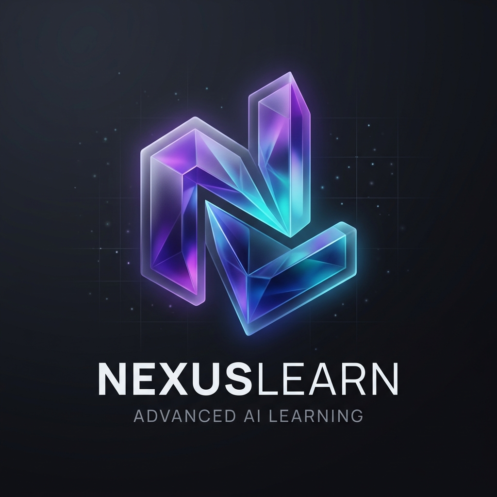

# NexusLearn AI

> **An intelligent E-learning ecosystem that transforms raw documents into structured, interactive learning experiences powered by Google Gemini AI.**



## Author

**Nguyen Minh Hien** - Creator, Designer & Developer

---

## Statement of Originality

This project is the **sole intellectual property** of **Nguyen Minh Hien**. The entire concept, feature design, system architecture, and user experience flow were independently ideated and planned starting from **mid-2025**.

Recently, a website under the name **"getstudymate"** has appeared with a suspiciously identical interface, naming convention, and feature flow to what I have been building. I want to make it absolutely clear: **NexusLearn AI (originally named StudyMate) is my 100% original work. I did NOT copy, steal, or derive any ideas from any individual or organization.** The project was rebranded to **NexusLearn** to establish a unique identity and eliminate any confusion with similar products.

---

## Key Features

| Feature | Description |
|---------|-------------|
| **Knowledge Map** | AI automatically extracts concepts and builds an interactive node-graph mind map with 360-degree navigation |
| **Lessons & Flashcards** | Auto-generates structured lessons (Basic to Advanced) and flashcard decks for effective memorization |
| **Quiz & Assessment** | Automatically creates multiple-choice quizzes after each lesson to reinforce learning |
| **Global AI Assistant** | System-wide chatbot that answers any general learning questions |
| **Document AI Tutor** | Context-aware AI tutor embedded in each document, deeply understands the material to explain complex concepts |
| **Premium UI/UX** | Glassmorphism design with smooth Dark/Light mode transitions, Bento Grid layout, and micro-animations |

---

## Tech Stack

- **Frontend:** React (Vite), Tailwind CSS, Framer Motion, Lucide Icons, React Flow
- **Backend:** Node.js, Express, TypeScript
- **AI Engine:** Google Gemini 2.5 Flash API
- **Data Processing:** PDF parsing via `pdf-parse`, custom text extraction

---

## Getting Started

### Prerequisites
- **Node.js** v18.x or higher
- **Google Gemini API Key** ([Get one here](https://aistudio.google.com/apikey))

### 1. Backend Setup

```bash
# Navigate to backend directory
cd backend

# Install dependencies
npm install
```

Create a `.env` file inside the `backend` folder:

```env
PORT=3001
JWT_SECRET=your_super_secret_jwt_key
GEMINI_API_KEY=your_gemini_api_key_here
```

Start the server:

```bash
npm run dev
```

The backend will run at `http://localhost:3001`

### 2. Frontend Setup

Open a **new terminal** (keep the backend running):

```bash
# Navigate to frontend directory
cd frontend

# Install dependencies
npm install

# Start the dev server
npm run dev
```

The app will be available at `http://localhost:5173`

---

## How It Works

1. **Upload** - Drop any PDF document or paste text content
2. **AI Analysis** - Gemini AI reads, analyzes, and extracts the knowledge structure
3. **Learn & Conquer** - Explore the Knowledge Map, complete lessons, and ace the quizzes

---

## License

This project is proprietary software created by **Nguyen Minh Hien**. All rights reserved.

> (c) 2026 NexusLearn AI by Nguyen Minh Hien. All rights reserved.